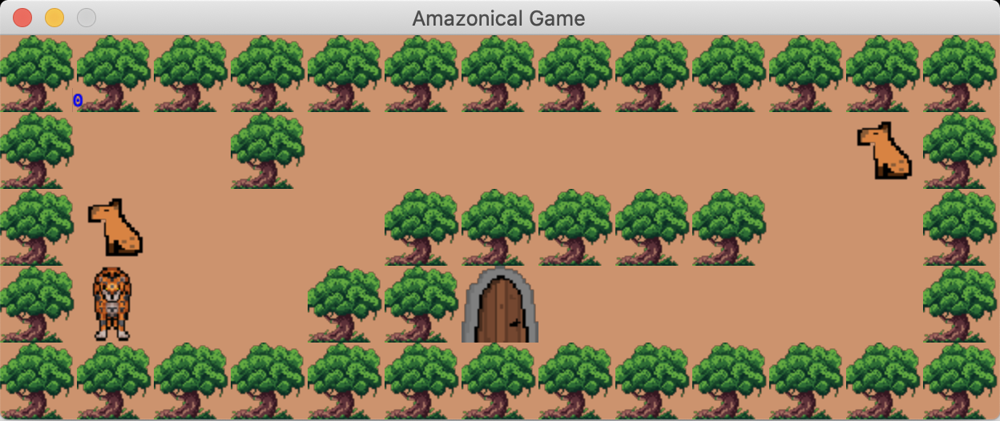
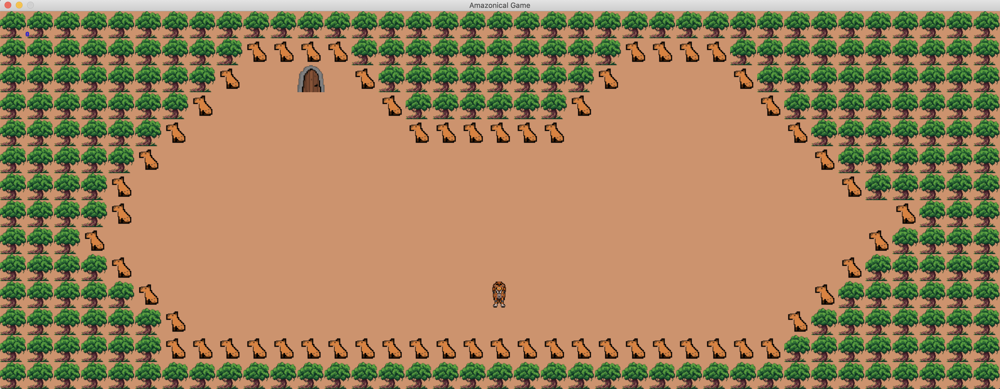

# so_long

This project is a small 2D game with minilibx. You'll learn about textures, sprites and tiles




## Getting Started
```
🚨 Please check that you have mlxlib installed in your machine.
```
### Install
```bash
$ make
```

### Usage
```bash
$ ./so_long [MAP_FILE.ber]
```
Only map files with extension `.ber` are available. Map file examples are available in the `maps/` directory.

```bash
$ ./so_long maps/map.ber
```
Run the code to use all the features of the game.



### HOW TO PLAY
The player’s goal is to collect all collectibles present on the map then escape with minimal movement.

|KEYBOARD|ACTION|
|---|---|
|`W`, `↑`|Move up|
|`S`, `↓`|Move down|
|`A`, `←`|Move left|
|`D`, `→`|Move right|
|`ESC`, `⎋`|Close the game window|

PS: The game is only configured for macOS :/ , since at 42 we work mostly with Apple machines.  

## Reference
 * [42Paris/minilibx-linux](https://github.com/42Paris/minilibx-linux)
 * [42Docs/minilibx](https://harm-smits.github.io/42docs/libs/minilibx)
